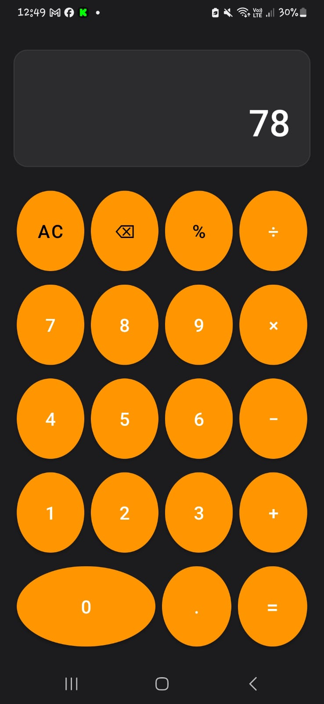
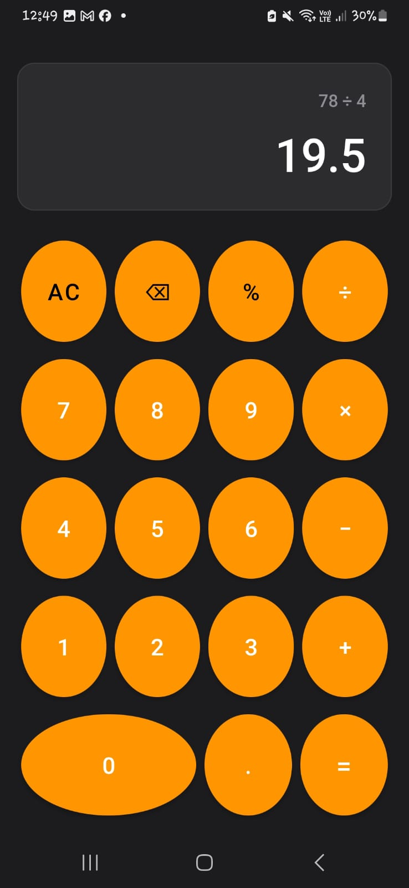
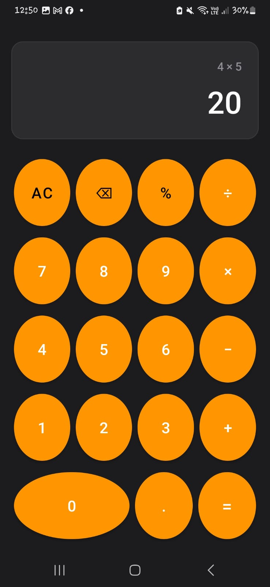
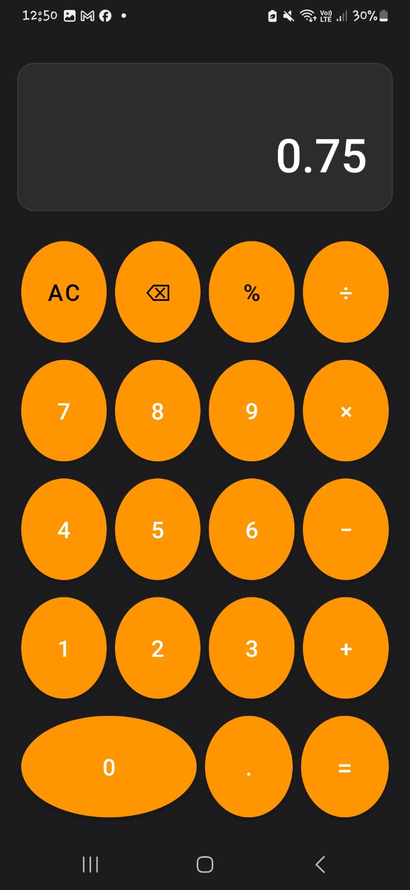

# 🧮 Calculadora Persistente con ViewModel - Semana 12

**Desarrollado por:** Valentino Guevara  
**Correo:** [202114033@uns.edu.pe](mailto:202114033@uns.edu.pe)  
**GitHub:** [ValentinoGuevara](https://github.com/ValentinoGuevara)  
**Curso:** Aplicaciones Móviles - Semana 12  

<div align="center">
  
</div>

## 🛠️ **Tecnologías Utilizadas**

<div align="center">
  <a href="https://developer.android.com/topic/libraries/architecture/viewmodel">
    
  </a>
  <a href="https://developer.android.com/topic/libraries/architecture/livedata">
    
  </a>
  <a href="https://kotlinlang.org/">
    
  </a>
  <a href="https://material.io/components">
    
  </a>
  <a href="https://developer.android.com/guide/components/activities/overview">
    
  </a>
</div>

## 🔍 ¿Cómo funciona la aplicación?

Esta aplicación de calculadora fue desarrollada para demostrar el uso de **ViewModel** en la gestión del estado. Permite realizar operaciones matemáticas básicas mientras **mantiene los datos activos** incluso cuando la pantalla rota o la actividad se recrea.

---

### 🏗️ Arquitectura y Flujo

1. **Uso de ViewModel**:
   - Almacena el número actual, operador seleccionado y resultado.
   - Persiste el estado durante cambios de configuración (como rotaciones).
   - Facilita una arquitectura desacoplada entre UI y lógica.

2. **Operaciones soportadas**:
   - ✅ Suma `+`
   - ✅ Resta `-`
   - ✅ Multiplicación `×`
   - ✅ División `÷`
   - ✅ Porcentaje `%`
   - ✅ Borrado de dígito individual y reinicio total

3. **Interfaz Moderna**:
   - Diseño visual inspirado en **Material Design**.
   - Botones grandes, claros y responsivos.
   - Compatible con modo oscuro.

---

### 🌟 Características Destacadas

| Característica | Descripción |
|----------------|-------------|
| 🧠 **ViewModel** | Control del estado lógico sin reinicios al rotar |
| 🧮 **Operaciones básicas** | Soporte completo para cálculos comunes |
| 🎯 **Botones de acción** | "AC", retroceso, igual y punto decimal |
| 🌙 **Tema oscuro** | Visualización cómoda y moderna |
| 🔄 **Estado persistente** | Mantiene resultados y entrada tras rotación |

---

### 📱 Capturas de Pantalla

<div align="center">
  <table>
    <tr>
      <td></td>
      <td></td>
      <td></td>
    </tr>
        <tr>
      <td></td>
      <td></td>
      <td></td>
    </tr>
  </table>
  <p>Interfaz de usuario clara, moderna y funcional</p>
</div>

---

## 🛠️ Implementación Técnica

### 🧩 Uso de ViewModel

```kotlin
class CalculatorViewModel : ViewModel() {
    private var _input = MutableLiveData("0")
    val input: LiveData<String> get() = _input

    fun onNumberClick(number: String) { ... }
    fun onOperatorClick(operator: String) { ... }
    fun onClear() { ... }
    fun onDelete() { ... }
    fun onEqual() { ... }
}
```

### 🧱 Dependencias y Herramientas

| Herramienta | Uso |
|-------------|-----|
| **Android ViewModel** | Persistencia de datos |
| **LiveData** | Observación reactiva en la UI |
| **Kotlin** | Lógica principal |
| **Material Design Components** | UI moderna |

---

## 🚀 ¿Cómo Ejecutarla?

1. Clona el repositorio:  
   ```bash
   git clone https://github.com/ValentinoGuevara/S12_Calculadora_ViewModel.git
   ```

2. Abre en **Android Studio** y espera que sincronice Gradle.

3. Ejecuta la aplicación en tu emulador o dispositivo físico.

---

## 🧩 Posibles Mejoras Futuras

- 🧮 Soporte para operaciones encadenadas (ej. 5 + 6 × 2).
- 🧠 Historial de cálculos realizados.
- 🗂 Tema personalizado para botones y fondo.
- 🗣 Soporte para accesibilidad (TalkBack, haptics, etc.).

---

## 📚 Contexto Académico

Este proyecto fue desarrollado como parte de la **Semana 12** del curso de Aplicaciones Móviles, con el objetivo de aplicar el patrón **MVVM** en aplicaciones Android mediante el uso de **ViewModel**.

---

## 📜 Licencia

**© 2025 - Valentino Guevara**  
Prohibido el uso comercial sin autorización expresa.

<div align="center">
  
  <p>¡Explora el código y contribuye!</p>
  <a href="https://github.com/ValentinoGuevara/S12_Calculadora_ViewModel">
    
  </a>
</div>
